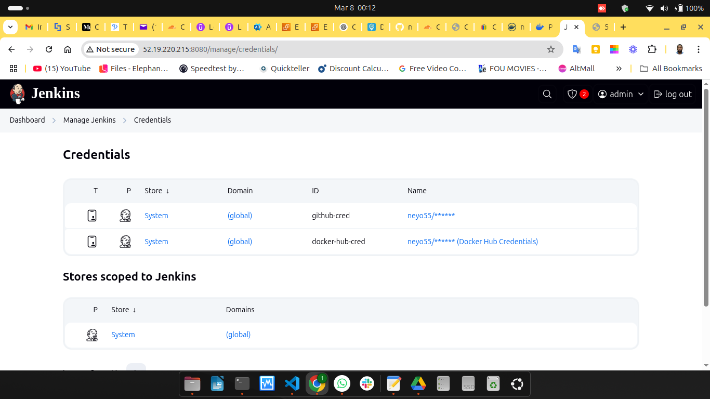
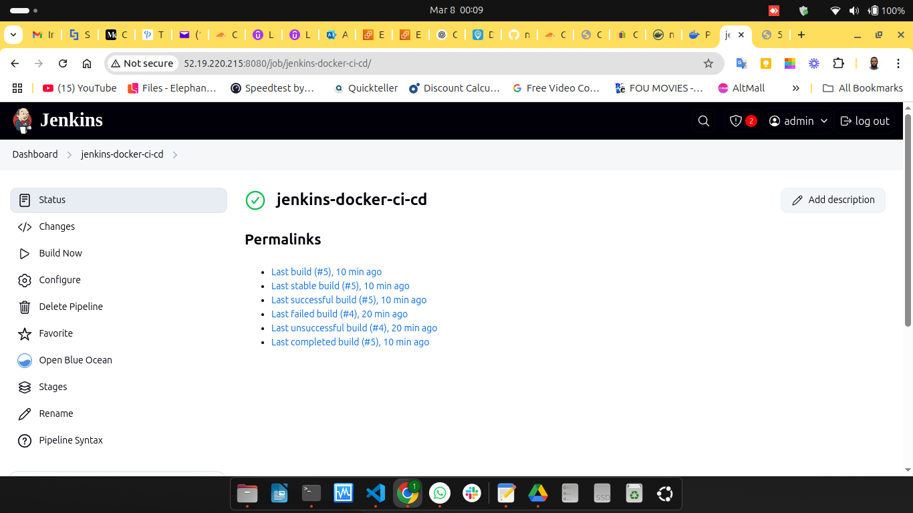

# **Step-by-Step Guide: Containerized CI/CD Pipeline with Jenkins & Docker**
This guide provides a **beginner-friendly**, **step-by-step** walkthrough on how to set up a **Jenkins CI/CD pipeline** that builds, tests, and deploys a containerized application using **Docker**.

---

## **Project Overview**
We will:
 Set up **Jenkins** on an **AWS EC2 instance**  
 Install **Docker** to containerize our application  
 Create a **Jenkins pipeline** to:
   - Clone a **GitHub repository**
   - Build a **Docker image**
   - Run **tests**
   - Push the image to **Docker Hub**
   - Deploy the **latest version of the app**
 Automate the entire process **using GitHub & Jenkins**

---

## **Step 1: Set Up AWS EC2 Instance**
### **1️ Launch an EC2 Instance**
- **Instance Type:** `t2.micro` (Free Tier eligible)
- **OS:** `Ubuntu 22.04 LTS`
- **Storage:** At least **10GB**
- **Security Group Rules:**
  - **SSH (22)** → Your IP
  - **HTTP (80)** → Anywhere
  - **Custom TCP (8080)** → Anywhere (for Jenkins)
  - **Custom TCP (5000)** → Anywhere (for our app)

### **2️ Connect to Your EC2 Instance**
```bash
ssh -i your-key.pem ubuntu@your-ec2-public-ip
```
Replace `your-key.pem` with your **private key** and `your-ec2-public-ip` with the **instance's public IP**.

---

## **Step 2: Install Docker**
Jenkins will use Docker to **build and deploy containers**.

### **1️ Install Docker**
```bash
sudo apt update && sudo apt install -y docker.io
```

### **2️ Enable & Start Docker**
```bash
sudo systemctl enable docker
sudo systemctl start docker
```

### **3️ Allow Jenkins to Use Docker**
```bash
sudo usermod -aG docker ubuntu
sudo chmod 666 /var/run/docker.sock
```

---

## **Step 3: Install Jenkins**
Jenkins will automate the pipeline.

### **1️ Add Jenkins Repository**
```bash
curl -fsSL https://pkg.jenkins.io/debian/jenkins.io-2023.key | sudo tee \
  /usr/share/keyrings/jenkins-keyring.asc > /dev/null

echo "deb [signed-by=/usr/share/keyrings/jenkins-keyring.asc] \
  https://pkg.jenkins.io/debian binary/" | sudo tee \
  /etc/apt/sources.list.d/jenkins.list > /dev/null
```

### **2️ Install Jenkins**
```bash
sudo apt update && sudo apt install -y openjdk-17-jdk jenkins
```

### **3️ Start Jenkins**
```bash
sudo systemctl enable jenkins
sudo systemctl start jenkins
```

### **4️ Get Jenkins Admin Password**
```bash
sudo cat /var/lib/jenkins/secrets/initialAdminPassword
```
🔹 Copy this password—you’ll need it to **unlock Jenkins**.

---

## **Step 4: Configure Jenkins**
### **1️ Access Jenkins Web UI**
- Open a browser and go to:
  ```
  http://your-ec2-public-ip:8080
  ```
- **Unlock Jenkins** using the password from Step 3️.

### **2️ Install Plugins**
- Select **"Install Suggested Plugins"**.

### **3️ Create an Admin User**
- Set up **username, password, and email**.

### **4️ Install Required Plugins**
- Go to **Manage Jenkins → Manage Plugins → Available Plugins**
- Install:
  - `Pipeline`
  - `Git Plugin`
  - `Docker Pipeline`
  - `Docker Commons`
- Restart Jenkins:
  ```bash
  sudo systemctl restart jenkins
  ```

---

## **Step 5: Create a GitHub Repository**
### **1️ Go to GitHub & Create a New Repo**
- Name it **`jenkins-docker-ci-cd`**
- Make it **Public** (or use credentials for a Private repo).

### **2️ Clone the Repository on the Instance**
```bash
git clone https://github.com/your-github-username/jenkins-docker-ci-cd.git
cd jenkins-docker-ci-cd
```

### **3️ Create Required Files**
```bash
touch Dockerfile app.py requirements.txt Jenkinsfile
mkdir tests
echo "Flask==2.2.5\nWerkzeug==2.2.3\ngunicorn==20.1.0\npytest==7.2.1\nrequests==2.28.2" > requirements.txt
echo "from flask import Flask\napp = Flask(__name__)\n@app.route('/')\ndef home():\n    return 'Hello from Jenkins CI/CD with Docker!'\nif __name__ == '__main__':\n    app.run(host='0.0.0.0', port=5000)" > app.py
echo "def test_sample():\n    assert True" > tests/test_sample.py
```
**Dockerfile**
```bash
# Use an official Python runtime as the base
FROM python:3.9-slim

# Set the working directory
WORKDIR /app

# Copy requirements and install dependencies
COPY requirements.txt .
RUN pip install --no-cache-dir -r requirements.txt

# Copy application files
COPY . .

# Expose the application port
EXPOSE 5000

# Run the application
CMD ["python", "app.py"]
```

**app.py**
```bash
from flask import Flask

app = Flask(__name__)

@app.route("/")
def home():
    return "Hello from Jenkins CI/CD with Docker!, task by neyo55"

if __name__ == "__main__":
    app.run(host="0.0.0.0", port=5000)

```

**requirements.txt**
```bash
Flask==2.2.5
Werkzeug==2.2.3
gunicorn==20.1.0
pytest==7.2.1
requests==2.28.2
```

**tests/test_sample.py**
```bash
def test_sample(): assert True
```

**JenKinsfile**
```bash
pipeline {
    agent any

    environment {
        DOCKER_IMAGE = "neyo55/jenkins-docker-ci-cd"
    }

    stages {
        stage('Clean Workspace') {
            steps {
                sh 'rm -rf *'
            }
        }

        stage('Clone Repository') {
            steps {
                git branch: 'main', url: 'https://github.com/neyo55/jenkins-docker-ci-cd.git'
            }
        }

        stage('Build Docker Image') {
            steps {
                sh 'docker build -t $DOCKER_IMAGE:latest .'
            }
        }

        stage('Run Tests') {
            steps {
                script {
                    def testDirExists = sh(script: 'if [ -d "tests" ]; then echo "exists"; else echo "missing"; fi', returnStdout: true).trim()
                    if (testDirExists == "exists") {
                        sh 'docker run --rm $DOCKER_IMAGE pytest tests/'
                    } else {
                        echo "No tests found, skipping test stage."
                    }
                }
            }
        }

        stage('Push to Docker Hub') {
            steps {
                withDockerRegistry([credentialsId: 'docker-hub-cred', url: '']) {
                    sh 'docker push $DOCKER_IMAGE:latest'
                }
            }
        }

        stage('Deploy to Test Environment') {
            steps {
                sh '''
                    docker stop test_container || true
                    docker rm test_container || true
                    docker run -d -p 5000:5000 --name test_container neyo55/jenkins-docker-ci-cd:latest
                '''
            }
        }
    }
}
```
---

## **Step 6: Create Credentials and a Jenkins Pipeline Job**
 1 **Go to Jenkins Dashboard → Manage Jenkins**  
 2 **Go to Credentials → global**  
 3 **Create for Github and also Dockerhub** 



### **Create a Jenkins Pipeline Job**
 4 **Go to Jenkins Dashboard → New Item**  
 5 **Enter "jenkins-docker-ci-cd"**  
 6 **Select "Pipeline" → Click OK**  
 7 **Scroll to Pipeline Section**

 8 **Definition → "Pipeline script from SCM"**

 9 **SCM → "Git"**

 10 **Repository URL**
   ```
   https://github.com/your-github-username/jenkins-docker-ci-cd.git
   ```
8️ **Branch** → `*/main`
9️ **Click Save & Apply**

---

## **Step 7: Write the Jenkins Pipeline**
Add this to **`Jenkinsfile`**:

```groovy
pipeline {
    agent any

    environment {
        DOCKER_IMAGE = "your-dockerhub-username/jenkins-docker-ci-cd"
    }

    stages {
        stage('Clean Workspace') {
            steps {
                sh 'rm -rf *'
            }
        }

        stage('Clone Repository') {
            steps {
                git branch: 'main', url: 'https://github.com/your-github-username/jenkins-docker-ci-cd.git'
            }
        }

        stage('Build Docker Image') {
            steps {
                sh 'docker build -t $DOCKER_IMAGE:latest .'
            }
        }

        stage('Run Tests') {
            steps {
                sh 'docker run --rm $DOCKER_IMAGE pytest tests/'
            }
        }

        stage('Push to Docker Hub') {
            steps {
                withDockerRegistry([credentialsId: 'docker-hub-cred', url: '']) {
                    sh 'docker push $DOCKER_IMAGE:latest'
                }
            }
        }

        stage('Deploy to Test Environment') {
            steps {
                sh '''
                    docker stop test_container || true
                    docker rm test_container || true
                    docker run -d -p 5000:5000 --name test_container $DOCKER_IMAGE:latest
                '''
            }
        }
    }
}
```

---

## **Step 8: Run the Pipeline**
1️ **Click "Build Now"** in Jenkins  


2️ Monitor the **Console Output**  
3️ **Check the Running App**
```bash
curl http://your-ec2-public-ip:5000
```

---

## **Conclusion**
**Your CI/CD Pipeline is now fully automated!**  
**Every GitHub push triggers Jenkins to build, test, and deploy the app.**  

---
